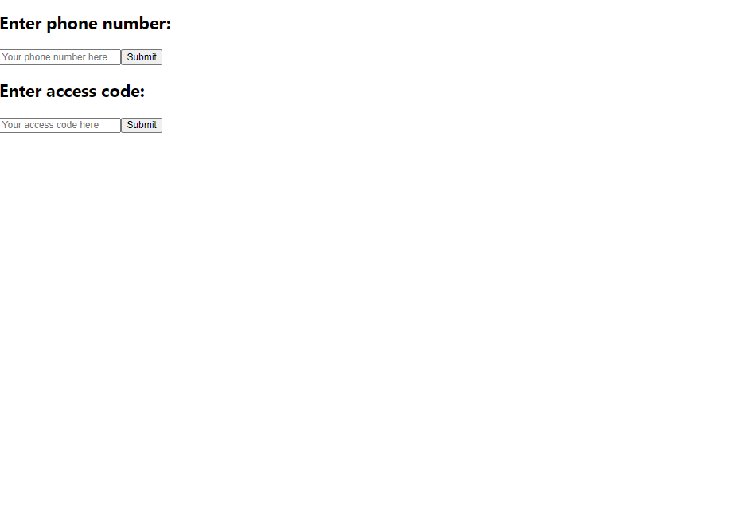
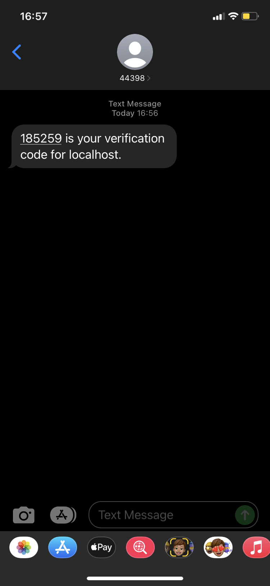

# Login App

This is a basic login application that takes in a phone number, then sends a random 6-digit code to the phone number received, and verify whether the access code entered is correct. 

The default mobile country code is +1 (United States).

This app was bootstrapped with [Create React App](https://github.com/facebook/create-react-app) and use [Firebase](https://firebase.google.com/) as database.

## Structure of the Project

This was essentially React app that was created using `create-react-app`. Approriate chunks of code from [Firebase](https://firebase.google.com/) documentation are included in `App.js`.

## Running the App

Make sure the `npm` has already been installed to your local machine by checking the current version of `npm`:

### `npm -v`

If `npm` has not been installed, install `npm` using:

### `npm install -g npm`

After the project is cloned into your local machine, in the project directory `login-app`, run the React app using:

### `npm start`

This will run the app in the development mode.\
Open [http://localhost:3000](http://localhost:3000) to view it in the browser.

# 

# 

